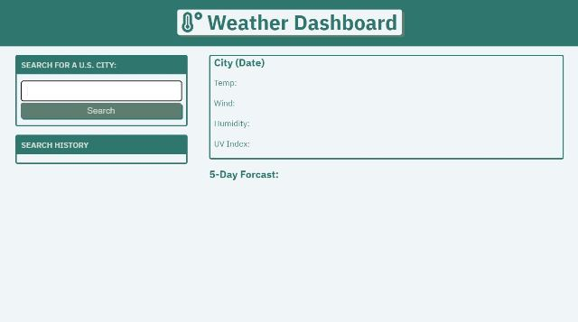
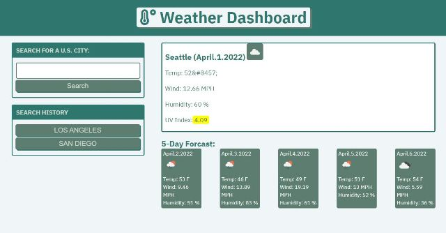
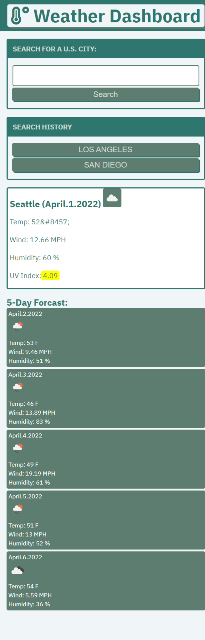

# Server-SideAPIs_Weather-Dashboard

## Description

- This is my first Server-Side API homework assignment for the Full Stack Web Development bootcamp.
- The homework assignment was to use a third-party API, OpenWeatherMap to build a weather dashboard that would run in a browser and feature dynamically updated HTML and CSS.
- Features incorporated to the final product are: A search bar for retreiving weather information for any U.S. city, a display of current day weather conditions, a display for five day weather forcast, and the ability to save searched cities to the page for future use.
- As a starting point, I used CSS and HTML files from one of week 6 in class activities. From there I built my JS from scratch and modified the CSS and HTML files as needed to suit the purpose of the homework assignment.
- In completing this assignment I was able to apply the lessons from week six and the following skills: Call and retrieve information from a third-party API, use API documentation to ensure proper usage of API retrieved data, use JS to manipulate the DOM in order to make my HTML dynamic, and save and retrieve data to and from the local storage. 

The following are screenshots of the final version of the webpage when it was first submitted for review. The first screenshot is of the page when it first opens. The Second screenshot shows it in use and the last screenshoot shows how the page would display in a smaller screen size device.

  
  
  

## Credits

For this homework assignment, I applied what was taught in the sixth week of class and used the following webpages as resources to bring the project together, especially the API documentation page for OpenWeather.com  

- [OpenWeatherMap](https://openweathermap.org/api/one-call-api#data/)  

- [Convert a Unix Timestamp to a Date in JS](https://coderrocketfuel.com/article/convert-a-unix-timestamp-to-a-date-in-vanilla-javascript/)  

- [OpenWeatherMap Icons](https://openweathermap.org/weather-conditions/)  

- [w3schools ref_attributes](https://www.w3schools.com/tags/ref_attributes.asp)  

## License

MIT License

Copyright (c) [2022] [Cristobal Marquez-Glynn]

Permission is hereby granted, free of charge, to any person obtaining a copy
of this software and associated documentation files (the "Software"), to deal
in the Software without restriction, including without limitation the rights
to use, copy, modify, merge, publish, distribute, sublicense, and/or sell
copies of the Software, and to permit persons to whom the Software is
furnished to do so, subject to the following conditions:

The above copyright notice and this permission notice shall be included in all
copies or substantial portions of the Software.

THE SOFTWARE IS PROVIDED "AS IS", WITHOUT WARRANTY OF ANY KIND, EXPRESS OR
IMPLIED, INCLUDING BUT NOT LIMITED TO THE WARRANTIES OF MERCHANTABILITY,
FITNESS FOR A PARTICULAR PURPOSE AND NONINFRINGEMENT. IN NO EVENT SHALL THE
AUTHORS OR COPYRIGHT HOLDERS BE LIABLE FOR ANY CLAIM, DAMAGES OR OTHER
LIABILITY, WHETHER IN AN ACTION OF CONTRACT, TORT OR OTHERWISE, ARISING FROM,
OUT OF OR IN CONNECTION WITH THE SOFTWARE OR THE USE OR OTHER DEALINGS IN THE
SOFTWARE.

## Badges

Coming Soon

## How to Contribute

Please feel free to review my code at [GITHUB](https://github.com/CM-GDev/Server-SideAPIs_Weather-Dashboard) for this project and make any suggestions for improvements.

Here is the live webpage [link](https://cm-gdev.github.io/Server-SideAPIs_Weather-Dashboard/) to the latest version. 